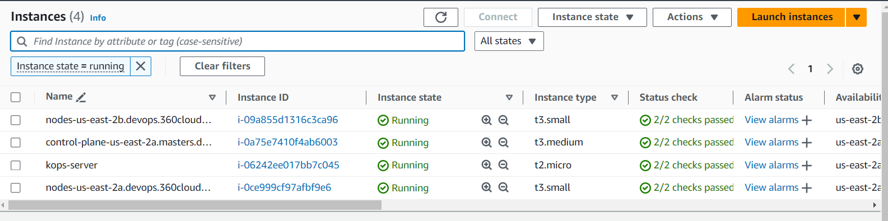
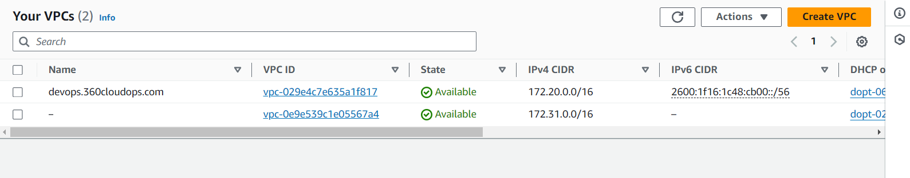
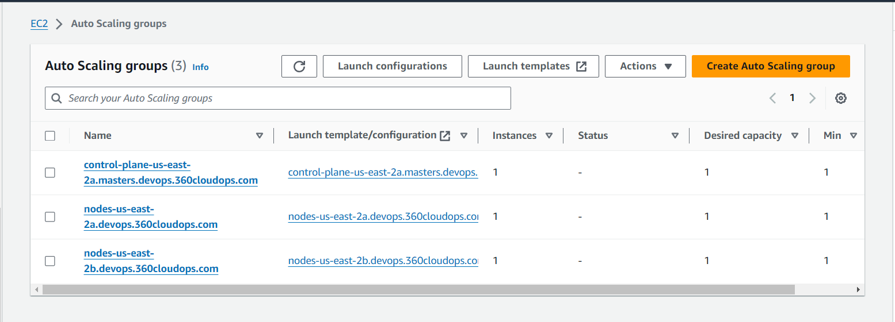
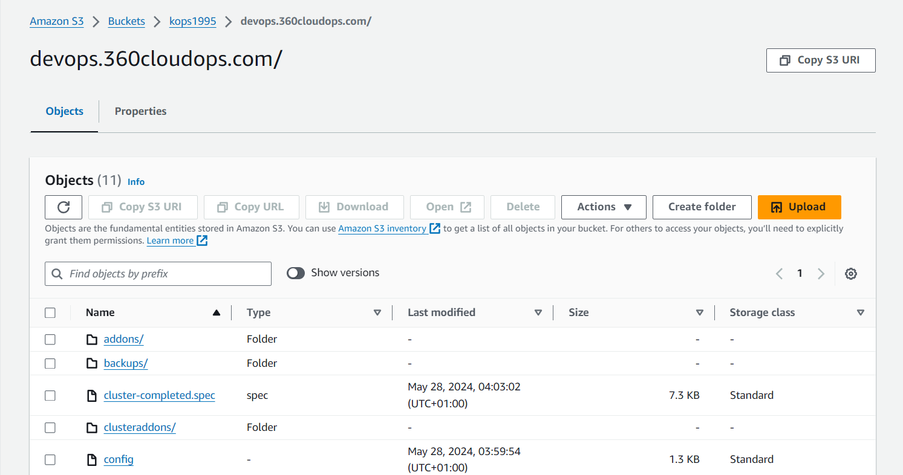
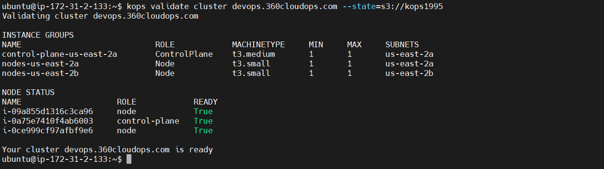

# Kubernetes with Kops on AWS

Kubernetes Operations (kOps) is used to provision kubernetes infrastructure on the cloud. It helps to create, destroy, upgrade and maintain production-grade, highly available, Kubernetes cluster.

https://kops.sigs.k8s.io/

In this project, we will setup the following:
    - A kubernetes cluster on AWS using kOps
    - Deploy a mongodb and mongo-express service on the cluster
    - Deploy a web application on the cluster and setup connection with mongodb

NB: To deploy kops, you need to have a domain name registered (In my case, it is 360cloudops.com)

## Create a Kubernetes cluster with kOps

1. Create a kops server (this can be a t2.micro) with ubuntu AMI
    - Create a new key pair
    - Create a new security group
    - For security, set security group rules source type to 'my Ip'
    - Launch the instance

2. Create an S3 bucket to serve as storage backend for the kops
    - Make sure s3 bucket region is same as the kops server subnet region
    - Enable versioning
    - Create bucket and note the name of the bucket.

3. Create an IAM user with permisions as specified in https://kops.sigs.k8s.io/getting_started/aws/
    - Go to IAM section on the console and create a new user
    - No need to enable console access as the user doesn't need it
    - Attach policies directly and give it administrator access
    - Create user.

4. Get the access key and secret key for this user.
    - Click on the user
    - Go to security credentials
    - Create the access key

5. Access kops instance via ssh

6. Do `sudo apt update -y`

7. `sudo apt install unzip -y`

8. Install aws cli following linux instructions https://docs.aws.amazon.com/cli/latest/userguide/getting-started-install.html

9. Configure aws
    - `aws configure`
    - set output as 'yaml'

10. Confirm configuration `aws s3 ls`

11. Create / Buy DNS
    - Login as root user on aws
    - Go to Route 53 and register a domain or transfer an existing domain
    - You can do `nslookup -type=ns domain-name` or `ping domain-name` on bash terminal

12. Create hosted zone and map to dns
    - Go to route 53 dashboard on the IAM account login and click on hosted zones
    - Create hosted zone (eg kops-devops.360cloudops.com) (kops-devops serve as subdomain)
    - Make it public hosted
    - Creating the hosted zone creates 4 name servers (under 'Records', and 'Value/Route traffic to')

13. Root User login section
    - Under Route 53 > Hosted zones > 360cloudops.com, click on create record
    - Switch to quick create.
    - Under record name, enter subdomain
    - Under record type, choose NS - Name servers for a hosted zone
    - Copy the 4 name servers from IAM section and paste under value.
    - Click create record (TTL is 300)
    - Confirm that status is INSYNC

14. Confirm
    - Do `nslookup -type=ns devops.360cloudops.com`

15. Installations
    - Install kubectl on the linux server following https://kubernetes.io/docs/tasks/tools/install-kubectl-linux/ using the binary with curl approach
        - Do `ll` to see the kubectl executable file
        - Give execute rights `chmod +x kubectl`
        - Do `sudo mv kubectl /usr/local/bin/` so it can be executed from any location on the server.
        - Do `kubctl` to confirm execution
    - Install kops (stable version) following https://github.com/kubernetes/kops/releases/tag/v1.28.0 (use 1.26.4)
        - Copy the kops-linux-amd64 link 
        - `wget https://github.com/kubernetes/kops/releases/download/v1.28.0/kops-linux-amd64`
        - Do `ll` to see the kops executable file
        - Give execute rights `chmod +x kops-linux-amd64`
        - Do `sudo mv kops-linux-amd64 /usr/local/bin/kops`
        - Do `kops` to confirm execution

16. Creating cluster using kops
    ```sh
       kops create cluster --name=devops.360cloudops.com \ (name of dns ie devops.360cloudops.com)
       --state=s3://s3-bucket-name --zones=us-east-2a,us-east-2b \ (s3 is bucket we created earlier and zones are ones we're in)
       --node-count=2 --node-size=t3.small \ (specifications for the two worker nodes)
       --master-size=t3.medium --dns-zone=devops.360cloudops.com \ (specifications for the master node)
       --node-volume-size=8 --master-volume-size=8
    ```
    - This will create our cluster and put some files in our s3 bucket

17. Bringing up the cluster
    `kops update cluster --name devops.360cloudops.com --state=s3://name-of-bucket --yes --admin`

    - You can now confirm your instances, s3 bucket, route 53 records, vpcs, internet gateways, subnets, route tables, auto-scaling groups

    

    

    

    

    `kops validate cluster devops.360cloudops.com --state=s3://name-of-s3-bucket` (devops.360cloudops.com is the name of my cluster) (may need to wait a few minutes before validation)

    

    `kubectl get nodes`

18. Deleting cluster
    `kops delete cluster --name=devops.360cloudops.com --state=s3://s3-bucket-name --yes`

19. Managing kubernetes configuration
    - In the home (~) directory of your server, do `ls -a`
    - You will see a ".kube" directory
    - Do `cat ~/.kube/config` to see configuration
    - Inorder to interact with your cluster locally without logging into your kops server:
        - Copy everything in the configuration file
        - Open a local terminal eg git bash or powershell
        - Confirm if there's already a local ~/.kube/config file. If there is, delete that `rm -rf ~/.kube/config`
        - Do `vi ~/.kube/config` and paste the kubernetes configuration here. Then save.
        - Do `cat ~/.kube/config` to confirm
        - Remember to already have kubectl installed locally (https://kubernetes.io/docs/tasks/tools/install-kubectl-windows/)
        - Now you can interact with the cluster locally on your terminal using the `kubectl` commands.

## Deployment with KOps on AWS

1. Start up the kops server and the cluster nodes
    - Do `kubectl get nodes` to see all nodes

2. `kubectl create ns name-of-namespace` to create a namespace
    - Do `kubectl get ns` to see the default and defined namespaces

3. Configure the mongo-secret, mongo-configmap, mongo-deployment and mongo-express with namespace data

4. In the kops server, make directory for the files and deployments eg /definitions/apps/

    - `vi mongo-secret.yaml` and paste the code
    - Do `kubectl apply -f mongo-secret.yaml`
    - `kubectl get secret -n name-of-namespace`

    - `kubectl get all -A` to see which resources are deployed in the various namespaces
    - `kubectl get all -n name-of-namespace` to see resources in particular namespaces

    - `vi mongo-configmap.yaml` and paste code
    - Do `kubectl create -f mongo-configmap.yaml` to apply
    - `kubectl get cm -n name-of-namespace`

    - `vi mongo-deployment.yaml` and paste code
    - Do `kubectl create -f mongo-deploment.yaml`
    - `kubectl get deployment -n name-of-namespace`

    + For mongo-express.yaml, under service, specify: 'type: NodePort' and 'nodePort: 30000' //This should not be used in production. Only for testing. In production, you use loadbalancer or ingress.
    - `vi mongo-express.yaml` and paste code
    - `kubectl create -f mongo-express.yaml`
    - `kubectl get pod -n name-of-namespace`
    - `kubectl get pod name-of-pod -n name-of-namespace -o wide`
    - `kubectl describe pod name-of-pod -n mane-of-namespace`
    - `kubectl get svc -n name-of-namespace`
        - Next, open port 30000 up in the security group (All traffic - My IP)
        - Copy public Ip of the instance and open on web with port 30000.
        - Create database and collections
    
    + Using LoadBalancer instead of NodePort
        - `kubectl get svc -n namespace` to see both deployments
        - `kubectl edit svc mongo-express-service -n namespace`
            - Edit the file:
                + Change type to LoadBalancer //This creates a 'Classic' load balancer on aws.
                + Remove '- nodePort: 30000'
                + Adjust as '- port: 80'
                + Save
        - `kubectl get svc -n namespace`
        - `kubectl describe svc mongo-express-service -n namespace`
        - Go to the instance page of aws and open 'Load Balancers'
            - There will be an active loadbalancer created by kubectl
            - Copy the DNS name and open in browser
        - Go to Route 53 > Hosted zones
            - Click on the domain name
            - Create a record
                + Change Record type to CNAME
                + Record name eg mongo-express
                + Paste loadbalance dns name in value field (remove http:// and the last /)
                + Create records
        - Now, mongo-express.domain-name will resolve to the mongo express page.

**Using ingress to communicate with different services in different namespaces**

> Using the docker image from jenkins for the app

1. Create namespace `kubectl create ns namespace`

2. Create a pod

    - Defined in devopsacad-pod.yaml
    - `vi devopsacad-pod.yaml` and paste code
    - `kubectl create -f devopsacad-pod.yaml`
    - Do `kubectl get all -n namespace`
    - `kubectl describe pod-name -n namespace`
    - `kubectl get pod -n namespace -o wide`

3. Create nodeport

    - Defined in devopsacad-nodeport.yaml
    - `vi devopsacad-nodeport.yaml` and paste code
    - `kubectl create -f devopsacad-nodeport.yaml`
    - Do `kubectl get svc -n namespace`
    - `kubectl describe svc -n namespace devopsacad-service`

4. Open in browser

    - Copy public ip address from the instance node the devopsacad-app was scheduled on and open in browser with port 30001

> Linking the app and the database with ingress

1. Revert port types to clusterip

    - For devopsacad-app
        + `kubectl get svc -n namespace`
        + `kubectl edit svc devopsacad-service -n namespace`
        + Change type to 'ClusterIP'. Removing the line entirely will do same as clusterip is the default
        + Remove 'nodePort: 30001' line
        + Now, do `kubectl get svc -n namespace`
        + This should automatically delete the loadbalancer on aws or you can delete manually
    
    - For mongo-express
        + `kubectl get svc -n namespace`
        + `kubectl edit svc mongo-express-service -n namespace`
        + Do same as above
        + Now, do `kubectl get svc -n namespace`

2. Deploy ingress-nginx controller to create a network load balancer

    - Run the network load balancer from https://kubernetes.github.io/ingress-nginx/deploy/#aws
    - Do `kubectl get ns`
        - This shows an ingress-nginx namespace created
    - Do `kubectl get all -n ingress-nginx`
        - This will show everything created in this namespace including a load balancer on aws

3. Create manifest file for the ingress

    - Defined in devopsacad-ingress.yaml //Use ingress-deployment// (template copied from https://kubernetes.io/docs/concepts/services-networking/ingress/)

    - For first host:
        - On the route53 page, edit the mongo-express.domain-name record value entered before to the network load balancer dns name
        - Create a new record:
            + record name eg devopsacad
            + record type is CNAME
            + value is the network load balancer dns name
        - Use the mongo-express.domain-name record name for first host
        
    - For second host:
        - Use the newly created record ie devopsacad.domain-name
    
    - `vi devopsacad-ingress.yaml` and paste
    - `kubectl create -f devopsacad-ingress.yaml`
    - `kubectl get ingress`

## Using Lens for visualization

1. Go to the root home directory of the kops server `cd ~`
    - `ls -a` shows a .kube directory which contains a config file
    - `cat ~/.kube/config` and copy everything

2. Installing lens
    - Download from https://k8slens.dev/

3. Open lens desktop
    - Go to catalog. Under clusters, click to add from kube/config.
    - Paste what you copied from .kube/config
    - Click on add cluster
    - Now, click on the cluster to connect
    - Click the cluster name dropdown top left and select settings
    - Click on lens metrics, enable all and apply
    - Still under settings, select metrics. In the prometheus dropdown, select lens
    - Now go back to the dashboard

4. On the server, 
    - `kubectl get ns` will show a lens-metrics namespace
    - `kubectl get all -n lens-metrics` will show all resources in that namespace

5. Resources
    - `kubectl describe node` will show resources used as seen in lens metrics
    - These resources can also be defined in the yaml file. See documentation at https://kubernetes.io/docs/concepts/configuration/manage-resources-containers/